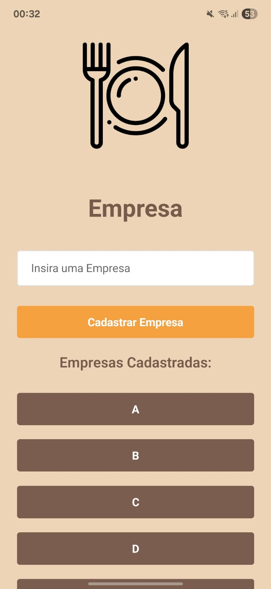
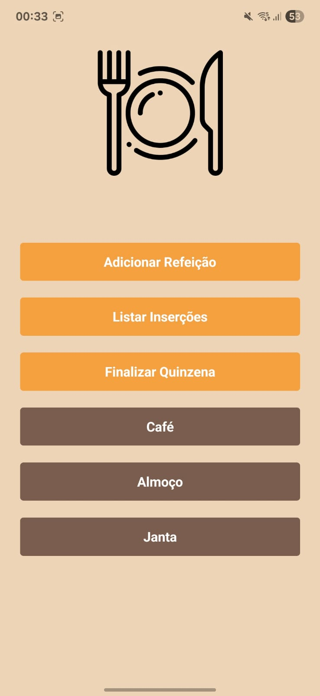
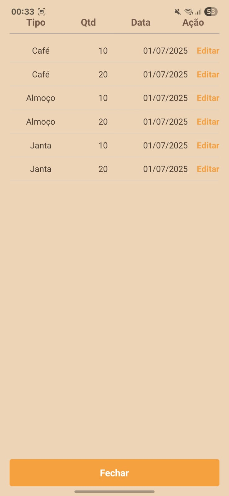
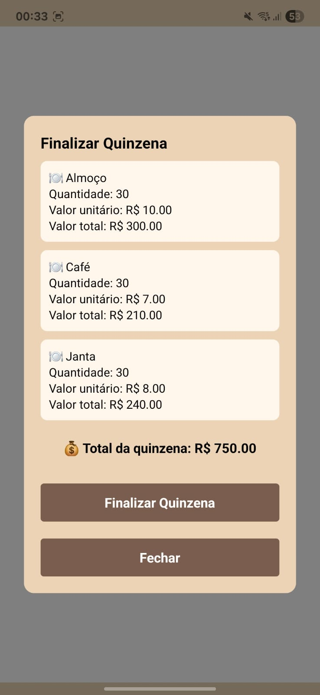

## QuinzenaApp


Este aplicativo foi criado para automatizar o cálculo quinzenal de refeições fornecidas por empresas de alimentação. Ele permite cadastrar empresas, criar refeições (como café, almoço e jantar), definir valores unitários e registrar quantidades consumidas.

O app calcula automaticamente o total da quinzena, economizando tempo e evitando erros manuais no controle dos valores.

O projeto foi desenvolvido com React Native, TypeScript e SQLite.


## Instruções de Instalação

```
npm install
```

```
npx expo start
```

## Instruções de uso

1. **Cadastro ou Seleção de Empresa**  
   Ao abrir o app, você pode **cadastrar uma nova empresa** ou **selecionar uma já existente**.

2. **Adição de Refeições**  
   Após escolher uma empresa, você será redirecionado para a tela de **criação de refeições** (como café, almoço ou jantar), informando o **valor unitário** de cada uma.

3. **Inserção de Quantidades**  
   Ao adicionar uma refeição, ela aparece como um **botão** na tela. Clicando nesse botão, é exibido um **modal** onde você pode **registrar quantidades** consumidas daquela refeição.

4. **Finalização da Quinzena**  
   Com todas as inserções feitas, você pode clicar em **“Finalizar Quinzena”** para visualizar:
   - Quantidade total de cada tipo de refeição
   - Valor total por tipo
   - Valor total da quinzena

5. **Visualizar Inserções**  
   Há também uma opção para **ver todas as inserções registradas**, mostrando:
   - Tipo da refeição
   - Quantidade inserida
   - Data da inserção

## Screnshots

### Tela de Empresas (Cadastro e Seleção)


### Tela de Refeições


### Inserção de Quantidades (Modal)


### Resumo da Quinzena


## Licença

Este projeto está licenciado sob a Licença MIT. Veja o arquivo [LICENSE](./LICENSE) para mais detalhes.